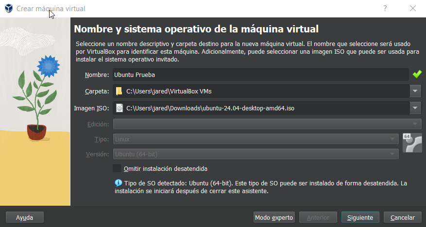
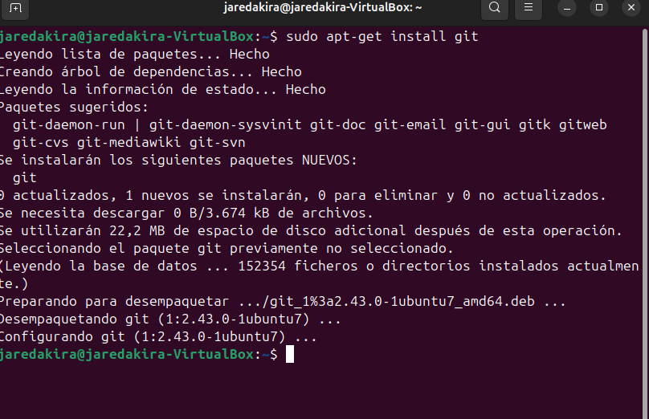
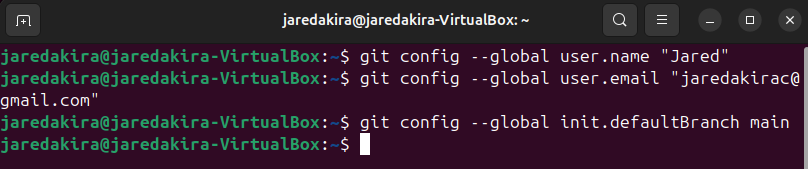
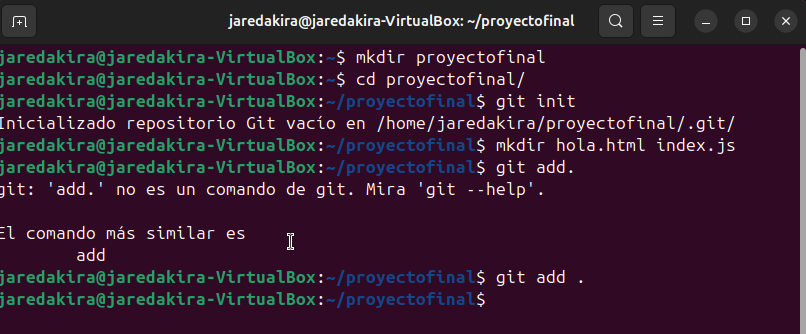
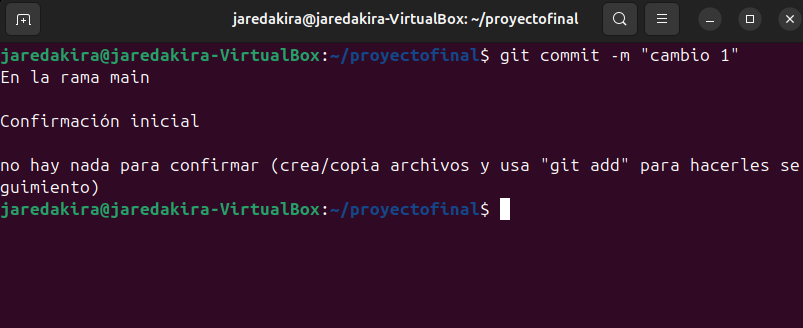

#GitHub y otros

Hoy aprenderemos qué es GitHub y para qué nos puede servir, así cómo los procedimientos necesarios para crear un repositorio git dentro de un directorio de proyecto.

¿Qué es GitHub y para qué sirve?

Git es un sistema de control de versiones distribuido, lo que significa que un clon local del proyecto es un repositorio de control de versiones completo. Estos repositorios locales plenamente funcionales permiten trabajar sin conexión o de forma remota con facilidad.

## Creación de máquina virtual 

Empezaremos por crear la máquina virtual. Seguiremos los pasos que hemos visto en anteriores clases. Usaremos Ubuntu como SO para la prueba.

## Instalación de git y configuración 

Si vamos a la terminal, instalamos git mediante el siguiente comando

Una vez hecho esto configuraremos nombre y email

Ahora crearemos un directorio con archivos dentro e iniciaremos un repositorio situados dentro de él, además los prepararemos para un commit mediante los siguientes comandos:

Así pues crearemos un commit con los cambios hechos mediante el siguiente comando:

